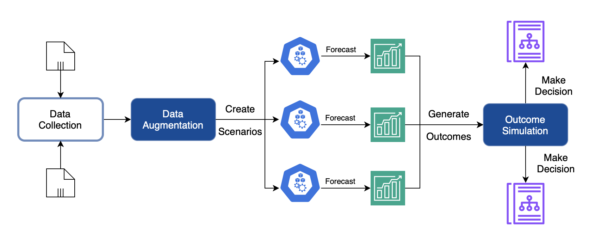
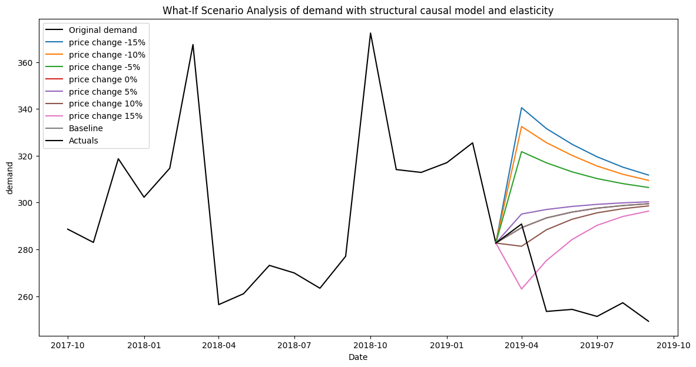
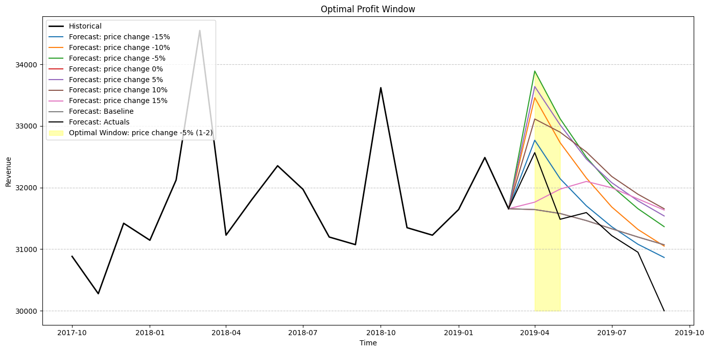

# TBWISA — Decision Intelligence for What-If Scenario Outcomes

This repository provides an implementation of **TBWISA (Transformer-Based What-If Scenario Analysis)**: a decision intelligence workflow for generating **what-if scenario outcomes** in e-commerce time series, focusing on **price interventions**, **demand response**, and **revenue / promotion window optimization**.

TBWISA combines:
- **Elasticity-driven counterfactual scenario generation** (log-log elasticity estimation with stochastic adjustment)
- **Transformer-based time series forecasting** (encoder-only transformer variants)
- **Outcome optimization** using optimal window selection (penalized sliding-window scoring over forecasted revenue, optionally incorporating demand)

Baselines included for scenario generation:
- **Log-Linear** regression scenarios
- **XGBoost** scenarios


## Publication

This implementation corresponds to the IEEE conference paper:

- A. Grigoraș and F. Leon, **Generating and Optimizing What-If Scenarios Using a Transformers-Based Forecasting Model** 2025 29th International Conference on System Theory, Control and Computing (ICSTCC), Cluj-Napoca, Romania, 2025, pp. 527-532, doi: 10.1109/ICSTCC66753.2025.11240464.

### BibTeX

```bibtex
@INPROCEEDINGS{11240464,
  author={Grigoraș, Alexandru and Leon, Florin},
  booktitle={2025 29th International Conference on System Theory, Control and Computing (ICSTCC)}, 
  title={Generating and Optimizing What-If Scenarios Using a Transformers-Based Forecasting Model}, 
  year={2025},
  volume={},
  number={},
  pages={527-532},
  doi={10.1109/ICSTCC66753.2025.11240464}}

```


## What you can do with this repo

* Train transformer forecasters for demand (and optionally price/promo-related signals)
* Generate **what-if scenarios** under different **price change policies** (e.g., −15%, −10%, … +15%)
* Forecast scenario outcomes into a configurable horizon
* Compare TBWISA with log-linear and XGBoost scenario generation baselines
* Compute and visualize:

  * scenario trajectories
  * forecasted outcomes per scenario
  * total revenue per scenario
  * best/optimal promotion window per scenario

### Decision Intelligence pipeline (end-to-end)

1. **Select time series** for an item/store
2. **Estimate elasticity** between price and demand
3. **Generate counterfactual scenarios** for multiple price-change policies
4. **Forecast scenario outcomes** using transformer forecasters
5. **Compute revenue trajectories**
6. **Detect optimal promotion window** per scenario (maximize outcome under a time window)

### Practical outputs

* scenario trajectories (price/demand)
* scenario outcome forecasts (demand)
* revenue curves and comparisons across scenarios
* best time window selection for each scenario policy


## Visuals

The repository includes reference images under `images/`:

* Framework overview:

* Scenario examples:

* Revenue comparison:

* Optimal window: `images/optimal_window.png`



## Environment setup

### Option A — Conda

```bash
conda create -n whatif-env python=3.10
conda activate whatif-env
pip install -r requirements.txt
```

### Option B — venv

```bash
python -m venv .venv
source .venv/bin/activate

pip install -U pip
pip install -r requirements.txt
```

Notes:

* Transformer forecasting uses TensorFlow/Keras.
* Some runs can remain non-deterministic across GPUs/TF builds even with fixed seeds.


## Data

A prepared sample dataset (Amazon Consumer Electronics) is included:

* `datasets/aws_ce_dataset.csv`

The notebooks expect a time series structure containing at least:

* `price` (intervention variable)
* `demand` (target variable)

and optional identifiers/time columns depending on your data preparation:

* e.g., `store_id`, `item_id`, `timestamp`

All paths are **relative to the project root**, and notebooks expect:

* datasets in `datasets/`
* saved models/artifacts in `trained-models/` (e.g., `.pkl` or `.joblib`)


## Quickstart

### 1) EDA / dataset preparation

* `eda_aws_ce.ipynb`: EDA and preparation for the AWS Consumer Electronics sample
* `eda_m5.ipynb`: optional EDA for M5 experiments

### 2) Train forecasting model

* `train_model.ipynb`

This notebook trains the transformer forecasters and may save artifacts to:

* `trained-models/`

### 3) Generate scenarios + optimize outcomes

* `generate_scenarios.ipynb`

This is the main end-to-end workflow:

1. load a selected time series (item/store)
2. generate TBWISA scenarios across a grid of price changes
3. forecast scenario outcomes
4. compute scenario revenue trajectories
5. detect the best promotion window per scenario


## How TBWISA works

### Elasticity estimation (log-log)

TBWISA estimates price elasticity with a log-log regression:

* `log(Q) = α + β log(P) + ε`

Where:

* `P` is price
* `Q` is demand
* `β` is the estimated elasticity

### Scenario generation (counterfactual demand)

For each price change (e.g., `ΔP%`), TBWISA:

* adjusts price by `(1 + ΔP)`
* adjusts elasticity (non-linear elasticity adaptation)
* generates counterfactual demand, including a bounded stochastic component

### Forecasting (transformers)

Scenario outcomes are forecast with encoder-only transformer models:

* `simple_transformer_forecasting.py`: baseline
* `improved_transformer_forecasting.py`: improved architecture/training utilities

### Optimal window selection (revenue-centric)

Revenue is computed from scenario price and scenario demand (or forecasted demand).
An optimal window is selected via a **penalized sliding-window search**, maximizing a score of the form:

* `score = avg_revenue(window) − penalty(window_length) + demand_term(optional)`

(See `source/tbwisa.py` for the implemented scoring details.)


## Programmatic usage (minimal)

The notebooks are the recommended “source of truth” for execution order and expected preprocessing.
If you prefer calling modules directly:

```python
import pandas as pd

from source.tbwisa import TBWISAGenerator
from source.improved_transformer_forecasting import ImprovedTransformerForecasting
from source.loglinear_scenarios import LogLinearScenarioGeneration
from source.xgboost_scenarios import XGBoostScenarioGeneration

df = pd.read_csv("datasets/aws_ce_dataset.csv")

input_col = "price"
output_col = "demand"

# Train a forecaster (configure parameters to match your notebook settings)
forecaster = ImprovedTransformerForecasting(sequence_length=30)
forecaster.train(df[output_col].values)

# TBWISA scenarios
tbwisa = TBWISAGenerator()
sc_inputs, sc_outputs = tbwisa.generate_scenarios(
    data=df,
    input_col=input_col,
    output_col=output_col,
    price_change_percentages=[-15, -10, -5, 5, 10, 15],
)

# Baselines (for comparisons)
loglin = LogLinearScenarioGeneration()
xgb = XGBoostScenarioGeneration()
```

If signatures differ in your local version, follow the notebooks (they reflect the intended pipeline wiring).


## Modules

* `source/tbwisa.py`
  Orchestration: elasticity estimation, scenario generation, scenario forecasting integration, and optimal window selection.

* `source/improved_transformer_forecasting.py`
  Improved encoder-only transformer forecaster for time series.

* `source/simple_transformer_forecasting.py`
  Minimal transformer baseline.

* `source/loglinear_scenarios.py`
  Baseline scenario generation using log-linear regression.

* `source/xgboost_scenarios.py`
  Baseline scenario generation using XGBoost regression.


## Metrics

Forecasting / errors:

* RMSE
* MAE

Decision intelligence / scenario evaluation (typical):

* Revenue uplift (scenario vs. baseline)
* ROI (promotion window effectiveness)
* Demand fulfillment / inventory-related proxies (if included in your experiments)
* Window compactness / length penalty effects (via the scoring function)

Exact metrics and plots depend on the notebook configuration used for each experiment.


## Developer workflows and conventions

* Main workflow notebook: `generate_scenarios.ipynb`
* Model training notebook: `train_model.ipynb`
* Dataset inputs are loaded from `datasets/`
* Trained artifacts are saved/loaded from `trained-models/`
* Plots/figures go to `images/`

Conventions:

* Transformer models use an **encoder-only** structure for time series forecasting.
* Scenario generation follows the pattern: **historical fit → elasticity estimation → counterfactual adjustment → stochastic bounding**.
* No external APIs are required; all data is local.


## Troubleshooting

* If TensorFlow installation fails, ensure your Python version matches supported TF wheels.
* If your dataset has missing timestamps, enforce a uniform frequency (daily/weekly) before training.
* If scenarios look implausible (e.g., exploding demand), inspect:

  * elasticity estimate stability
  * clipping / bounds on demand changes
  * stochastic noise scale


## License

See `LICENSE`.


## Acknowledgements

* Amazon Forecast related time series sample dataset (if used in your experiments)
* Transformer architecture inspired by “Attention is All You Need”
